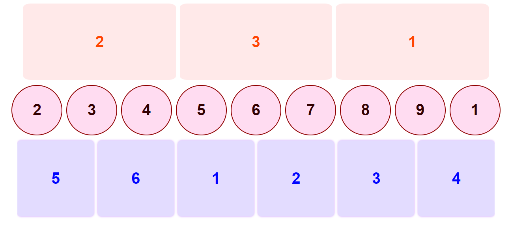
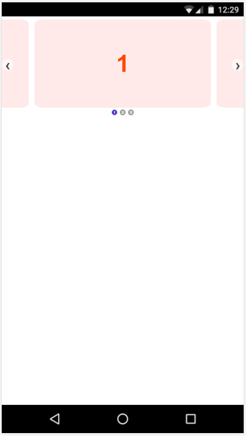

<h1 align="center">
  
  Welcome To Advance Infinite Carousel
</h1>

<h3 align="center">
  Work Like Normal Card
</h3>
<h3 align="center">

</h3>

<h3 align="center">
  On Resize Transfer Into A carousel
</h3>
<h3 align="center">

</h3>

<h3 align="center">
  We Can Add Multiple Carousel With Different Cards Style
</h3>
<h3 align="center">

</h3>

